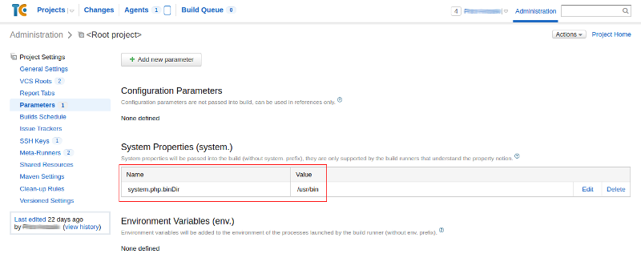
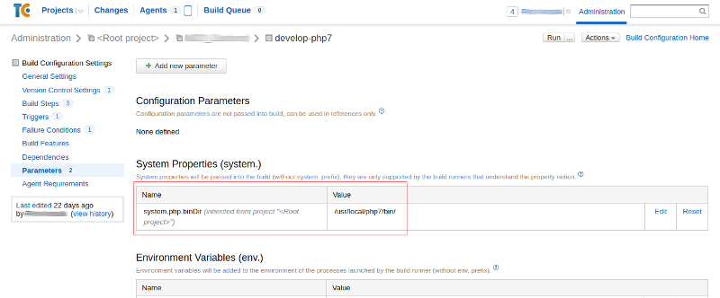

# TeamCity Meta Runners

This is a modified version from [Meta-runner Power Pack](https://github.com/JetBrains/meta-runner-power-pack).

Allow to set path to binary _PHP_ eg. if we need testing multiple code with multiple _PHP_ version.
You must set system parameter _system.php.binDir_ with path to _PHP_ binary, example:
_system.php.binDir_ set to _/usr/bin_ - without ending slash to global usage.

Custom Build Configuration inherit this parameter but allow to extend.

## License

This code is under the MIT license. See the complete license in the code:

    LICENSE
